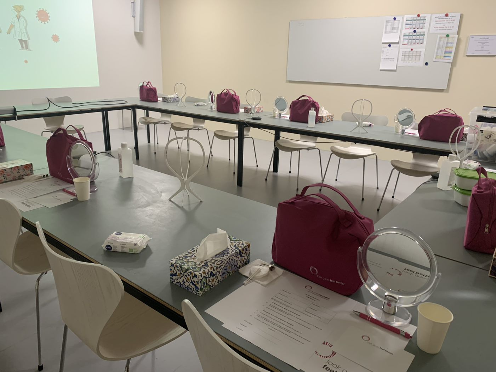
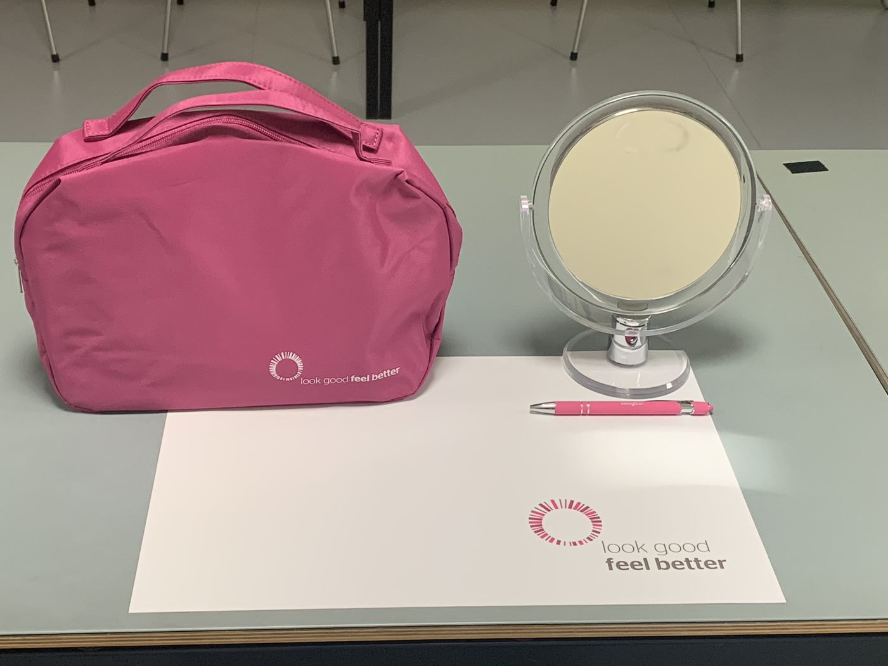
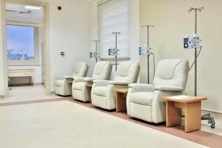
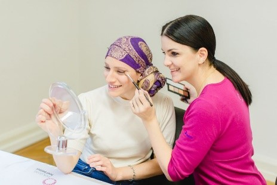

+++
title = "Mit Selbstvertrauen gegen Brustkrebs kämpfen"
date = "2022-12-01"
draft = true
pinned = true
tags = ["Example", "Lernblog"]
image = "/img/default-image.jpg"
description = ""
footnotes = "In der Fusszeile können zum Beispiel Bildquellen angegeben werden. Dieser Text ist abgetrennt durch eine Linie und etwas kleiner."
+++

Die Schönheit bei Brustkrebs ist das Überleben. Doch durch die körperlichen Veränderungen wird die Weiblichkeit auf eine harte Probe gestellt. 


Ein Knoten in der weiblichen Brust sorgt für Panik. Brustkrebs ist die häufigste Krebskrankheit bei Frauen und sollte schnellstmöglich behandelt werden. Die Krankheit schwächt nicht nur den Körper oder verursacht Nebenwirkungen, sondern kann das Selbstbild einer Frau einschränken. 


1989 gab es in den USA eine Brustkrebspatientin, die wegen ihrem äusserlichen Erscheinungsbild das Spital nicht mehr verlassen wollte. Der Arzt hat daraufhin eine Kosmetikerin engagiert, welche ihr eine schöne Kopfbedeckung gemacht hat und sie auch schminkte. Danach schaute die Patientin mit einem Lächeln in den Spiegel und war bereit, nach Hause zu gehen. Das war der Beginn von der Stiftung “look good feel better”. Im Jahr 2005 wurde die Stiftung auch in der Schweiz gegründet. Heute ist die Stiftung in 27 verschiedenen Ländern vertreten. Die Stiftung bietet in der ganzen Schweiz Kurse an, in denen die Krebspatientinnen lernen, wie sie die gereizte Haut pflegen und schminken können, damit die Krebspatientinnen sich als Frau wiedererkennen und sich nicht ihre eigene Haut schämen. Die Schminkkurse sind eine ehrenamtliche Sache und werden von Kosmetikexpertinnen geleitet.


An einem Dienstagnachmittag gehen wir in die Frauenklinik des Inselspitals in Bern. Dort besuchen wir einen Kurs der Stiftung ,,look good feel better’’. Wir treffen eine der beiden ,,Breast & Cancer Care Nurses’’ der Frauenklinik. Gemeinsam warten wir auf die Kosmetikerinnen, welche den Kurs leiten. Als alle da sind, gehen wir in einen hellen Raum im Untergeschoss der Klinik. 

Die Kosmetikerinnen haben die Plätze der Teilnehmerinnen mit Utensilien für den Kurs eingerichtet und mit einem Schminkspiegel ergänzt. Wir beobachten alles gespannt. Nach einer Weile treffen schon die ersten Krebspatientinnen. 

,,Wow, diese wunderschönen starken Frauen” denken wir uns, als die Brustkrebspatientinnen den Raum betreten. Jede ist so verschieden und auf eine ganz besondere Weise wunderschön. Ein paar tragen Tücher auf dem Kopf und die Augenbrauen sowie Wimpern sind nur ganz fein, zu erkennen.

Sie setzen sich auf einen Platz, an welchem ein pinker Kosmetikbeutel bereitsteht. In diesem befanden sich Kosmetikartikel wie Pflege- und Schminkprodukte, welche von verschiedenen Marken –wie Bobby Brown, Nivea, La Roche Posay etc.- gesponsert sind. Die Schminksachen sind im Set aufeinander abgestimmt und es sind aktuelle Produkte, so dass man sie auch nachkaufen kann.

Der Kosmetikbeutel ist nicht das einzige pinke Utensil. Die Farbe Pink verkörpert die Krankheit Brustkrebs. Im Brustkrebsmonat, der Oktober, begegnet uns eine pinke Schleife häufig. Die Pink Ribbon wird verwendet, um Solidarität mit Brustkrebspatientinnen auszudrücken, gleichzeitig das Bewusstsein und die Aufmerksamkeit für das Thema zu schärfen. Es gibt viele Unternehmen, die ein Teil vom Umsatz eines Produktes der Stiftung Pink Ribbon spenden. 

### Die Krankheit Burstkrebs

Jährlich werden bei etwa 6000 Frauen Brustkrebs diagnostiziert. Brustkrebs kann auch Männer treffen, aber Frauen erkranken häufiger daran. Es gibt nur wenige Anzeichen, welche auf Brustkrebs hindeuten. Deshalb ist es wichtig, regelmässig einen Kontrolltermin bei der Frauenärztin zu vereinbaren und sich untersuchen zulassen.

Oft fühlt sich die Frau bei der Entdeckung der Krankheit kerngesund. Doch die Zellen des bösartigen Tumors verbreiten sich im gesunden Gewebe der Brust und zerstören dieses. Ein Tumor entsteht durch unkontrollierte Zellenvermehrung. Diese Zellen werden durch ein Karzinogen, einen krebserregenden Organismus, genetisch verändert und die Zellen teilen sich sehr schnell. Diese Zellgruppe kann unser Körper nicht mehr bekämpfen.

Über Lymph- und Blutbahnen können sich die Krebszellen im ganzen Körper ausbreiten. Das Blut in den Blutbahnen, welche über die Arterie der Achselhöhle und des Brustbeines in die Brust fliessen, versorgen die Brust mit Nährstoffen und Hormonen. 

Die Lymphflüssigkeit enthält weisse Blutkörperchen und Antikörper und spielt somit eine wichtige Rolle in unserem Immunsystems. Wenn das Mammakarzinom, so der Fachbegriff für Brustkrebs, die Lymphknoten erreicht, können sich dort Metastasen bilden. Unter Metastasen versteht man, wenn sich Krebszellen vom ursprünglichen Ort der Entstehung des Tumors gelöst haben und sich in einem neuen Krankheitsfeld angesiedelt haben. Ärzte und Ärztinnen sagen, dass der Tumor streut. Metastasen lassen die Brust etwas aufschwellen, was man als Knoten ertasten kann.

Die Ursachen von Brustkrebs sind zurzeit noch unbekannt. Doch es gibt bestimmte Ursachen, welche das Risiko einer Erkrankung an Krebs erhöhen können. Zum Beispiel: Vorerkrankungen in der Familie, Alkohol- oder Tabakkonsum und Übergewicht.

### «In diesem Moment hat sich vor mir ein Loch aufgetan.»

> *Florence Schneider*


Florence Schneider hat 2017 erfolgreich gegen Brustkrebs gekämpft. Sie hat zwei Kinder und ist verheiratet. Der Moment, als sie die Diagnose bekam, war für sie schrecklich. «Die Nachricht kam wie aus heiterem Himmel, so was kann jeden Tag passieren», sagt sie. «Deshalb können wir nicht immer Angst haben, das bringt uns nicht weiter. Und wir sollten das Leben geniessen, weil es viel zu kurz ist.» Mit diesen positiven Gedanken geht sie heute durchs Leben. Ihr Ehemann hat sie in dieser schweren Zeit stets unterstützt und war sozusagen ihr Sparringpartner. Sie wollten die Kinder erst informieren, als sie über das weitere Vorgehen der Therapie Bescheid wussten. Im Sommer 2022 bestätigt der Onkologe in einer Nachkontrolle nach fünf Jahren, dass sich der Brustkrebs zurückgezogen hat. Daher ist das Risiko eines Rückfalls sehr klein. «Man sollte stets mit positiven Gedanken dieser Krankheit trotzen und kämpfen, kämpfen und kämpfen!».


Die Kosmetikerinnen begrüssen die Brustkrebspatientinnen und zeigen Schritt für Schritt, wie man das Gesicht am besten pflegen kann. Dabei erklären sie, dass es durch eine liebevolle Körper- und Schönheitspflege helfen kann, sich schrittweise in der eigenen Haut wohler zu fühlen. Die Hautpflege ist auch wichtig, weil durch die Chemotherapie die Haut etwas gereizt oder trocken ist. Nebenbei verstopfen die Medikamente die Haut und deshalb ist eine Gesichtspflege morgens wichtig. 

### Die Chemotherapie bei Brustkrebs

Es gibt viele Möglichkeiten, Krebspatienten und Krebspatientinnen zu behandeln. Es kommt ganz auf die Krebsart und auf das Krankheitsstadium an, welche Therapien eingesetzt werden.
 Die Krebsart von Florence Schneider konnte nur mit einer Chemotherapie behandelt werden.  Die Chemotherapie ist eine von vielen Therapien, welche die Vermehrung von Krebszellen verhindern soll. Dabei werden die Krebszellen zerstört. Das Medikament, das bei dieser Therapie eingesetzt wird, nennt man "Zytostatika". Das eingesetzte Zytostatikum ist auf die Krebsart und das Krankheitsstadium abgestimmt. Doch die Chemotherapie führt häufig zu starken Nebenwirkungen, weil das Zytostatika zwischen gesunden Zellen und ungesunden Krebszellen nicht unterscheiden kann. Aufgrund der Schädigung gesunder Zellen treten während der Behandlung Nebenwirkungen wie Erschöpfung, Übelkeit, Erbrechen und Nervenstörungen auf. Weiter können auch allergische Reaktionen auftreten.

Florence Schneider erzählt uns, dass sie nach ein paar Tagen der ersten Behandlung mit der Chemotherapie Veränderungen an ihrer Kopfhaut gespürt hat. Eine sehr häufige Nebenwirkung ist der Haarausfall, da das eingesetzte Medikament die Haarwurzelzellen beschädigt. Infolgedessen hat sie sich ihr langes Haar kurz schneiden lassen.

Die Chemotherapie wird in mehreren Zyklen verabreicht. Über einen Portkatheter wird ein Zugang in die Vene gelegt, über den die Infusion mit dem Medikament direkt in den Körper gelangt. Der Portkatheter bleibt während der gesamten Zeit an der gleichen Stelle, sodass die Vene während der verschiedenen Zyklen nicht immer wieder neu gestochen werden muss. Während diesen Zyklen überwacht man immer wieder, ob sich das Karzinom zurückbildet. Zwischen diesen Zyklen ist eine Pause sehr wichtig, damit sich die gesunden Zellen des Körpers von dem Medikament erholen können. In diesen Pausen fühlen sich die Patienten/Patientinnen relativ gut. Florence Schneider konnte dann jeweils normal arbeiten gehen. Die Patienten werden während einer solchen Therapie regelmäßig überwacht. Damit, zum Beispiel bei einer allergischen Reaktion Ärzte und Ärztinnen schnell handeln können.

> ### «Als ich in den Spiegel schaute, musste ich sagen, so schlimm ist es gar nicht.»
>
> *Florence Schneider*

Nach dem Abschminken und der Gesichtsreinigung beginnt das Schminken. Die Kursleiterinnen erklären, welches Produkt man wofür verwendet. Die Teilnehmerinnen nehmen das Produkt und verwenden es, wie es vorgezeigt wurde. Sehr einfühlsam kümmern sich die Kosmetikerinnen und gehen individuell sowie sehr persönlich auf die Kursteilnehmerinnen ein.

Durch die Chemotherapie fallen die Augenbrauenhärchen sowie die Wimpern aus. Im Kurs lernen die Teilnehmerinnen, wie man Augenbrauen nachschminken kann, was erstmal eine Herausforderung ist. Die Kosmetikerinnen geben den Frauen auch Mut, die Wimpern zu tuschen, weil die Wimpern nicht immer komplett ausfallen. Dabei kann man mit einem Lidstrich die Augen noch mehr betonen. ,,Jetzt weiss ich, wie man eine Mascara richtig verwendet”, sagt eine Teilnehmerin glücklich. Das war ein berührender Moment, denn ihr Strahlen ist herzerwärmend.

### Die belastenden äusserlichen Veränderungen

Brustkrebs kann das äusserliche Erscheinungsbild von Frauen verändern. Haarausfall, Verlust von Augenbrauen- und Wimpernhaaren und eine Veränderung der Haut können durch die chemische Behandlung auftreten. Diese Nebenwirkungen beeinträchtigen das Selbstvertrauen der Patientinnen.

Viele Frauen haben damit zu kämpfen, dass sie sich durch die äusserliche Veränderung nicht mehr attraktiv finden - und das beeinträchtigt ihr Selbstbild sehr. Wir wollen hier ein Statement setzen: Jede Frau ist auf ihre eigene Art wunderschön!

Um sich wieder in der eigenen Haut wohlzufühlen, braucht es Zeit. Aber für eine befriedigende Sexualität und ein gewisses Wohlbefinden ist es wichtig, dass man versucht, diese Veränderungen zu akzeptieren und sich im "neuen" Körper wohlzufühlen. 

Florence Schneider akzeptierte ihre kurzen Haare. Wenn sie unter Menschen ging, trug sie eine Perücke, Tücher oder eine Mütze. Die heutige Qualität der Perücken ist so gut, dass man zwischen echten und ’falschen’ Haaren kaum mehr unterscheiden kann. 

Bei Brustkrebs können nicht nur die Haare ausfallen, sondern durch die Entfernung von Brustgewebe kann sich die Oberweite verkleinern. Diese Verkleinerung kann das Körpergefühl und das weibliche Selbstverständnis beeinträchtigen.

Am Ende vom Workshop sitzen hier wunderschöne natürliche geschminkte Frauen. Jede hatte ein Strahlen im Gesicht. Dieser Kurs ist für uns sehr berührend und eine Freude, dass wir dabei sein konnten. Wir glauben, dass dieser Workshop Brustkrebs-Betroffenen sehr helfen kann, weil es das Selbstvertrauen fördert und ein stabiles Selbstvertrauen für die Genesung wichtig ist. Bevor wir gehen, sprechen wir eine Krebspatientin an. Wir unterhalten uns ein wenig und sagen ihr, wie sehr wir sie und alle Betroffenen bewundern. Sie lächelt herzlich und umarmte uns. Wir wünschen allen Betroffenen das Beste!

### Schlusswort

Brustkrebs ist eine Krankheit, die vieles im Leben auf den Kopf stellt, das Aussehen verändert und das Verhältnis zum Körper negativ beeinflusst. Man sollte das Leben mit der Krankheit so gestalten, dass man sich in der eigenen Haut wohlfühlt. Es kann jeden und jede treffen. Man trägt keine Schuld, wenn sie einen trifft. Der Kampf gegen Brustkrebs erfordert viel Kraft, Selbstvertrauen, mentale Stabilität, Hoffnung, die Unterstützung von Mitmenschen und natürlich hochentwickelte Medikamente sowie eine intensive medizinische Betreuung. Wir sind nachhaltig beeindruckt von dieser Erfahrung.